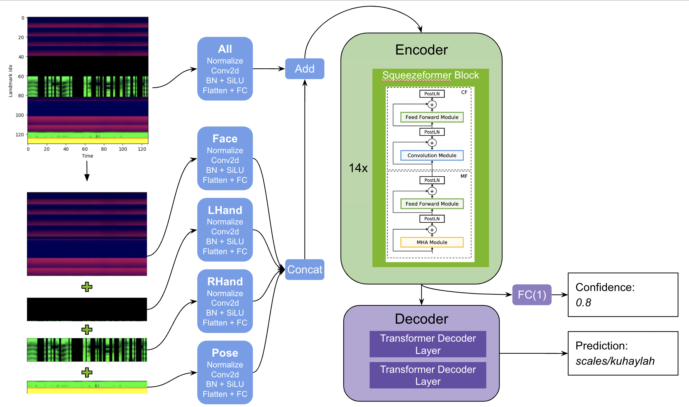

## SIGNA : TRADUCTOR DE LENGUAJE DE SEÑAS PERUANO

Nuestra solución se basa en una arquitectura única de codificador-decodificador. El codificador es una versión significativamente mejorada de Squeezeformer, en la que la extracción de características se ha adaptado para manejar puntos de referencia de la tubería media en lugar de señales del habla. El descodificador es un simple transformador de dos capas. Además, predijimos una puntuación de confianza para identificar ejemplos corruptos que pueden ser útiles para el postprocesamiento. También introdujimos aumentos eficientes y creativos para regularizar el modelo, siendo los más importantes CutMix, FingerDropout y TimeStretch, DecoderInput Masking. Utilizamos pytorch para desarrollar y entrenar nuestros modelos y luego tradujimos manualmente la arquitectura del modelo y portamos los pesos a tensorflow, desde donde exportamos a tf-lite.




## PROTOTIPO
Observa la aplicación de forma real
```
https://www.figma.com/proto/xW2Ub4t3854gFxsl8ZPPW4/Untitled?type=design&node-id=2-6&t=lGWZMlX7T8NxsqmK-1&scaling=scale-down&page-id=0%3A1&starting-point-node-id=2%3A6&mode=design
```


## PREPARACIÓN

Utilizamos el  `nvcr.io/nvidia/pytorch:23.07-py3` contendedor del [ngc catalog](https://catalog.ngc.nvidia.com/orgs/nvidia/containers/pytorch) para tener un entorno coherente entre los miembros del equipo. Puede ejecutarlo a través de:
`docker run --gpus all -it --rm nvcr.io/nvidia/pytorch:23.07-py3`

Dentro del contenedor clone este repositorio e instale los paquetes necesarios con ```
git clone https://github.com/AngelinaFencyt/TraductorFencyt.git '''
cd kaggle-asl-fingerspelling-1st-place-solution
pip install -r requirements.txt


Por defecto el entrenamiento se registra a través de neptune.ai en un proyecto quickstart. Si quieres usar tu propio proyecto neptune establece `cfg.neptune_project` en `configs/cfg_1.py` y `configs/cfg_2.py`. 

      
### 1. Entrenar ronda 1

Entrena 4 pliegues de cfg_1:

```
python train.py -C cfg_1
python train.py -C cfg_1 --fold 1
python tren.py -C cfg_1 --pliegue 2
python tren.py -C cfg_1 --pliegue 3
```

Añada las predicciones oof del paso 1. a train_folded.csv y concaténelas con metadatos suplementarios:

```
python scripts/get_train_folded_oof_supp.py 
```

### 2. Entrenar ronda 2

Entrena 2x semillas fullfit de cfg_2:

```
python train.py -C cfg_2 --fold -1
python train.py -C cfg_2 --fold -1
```

### 3. Conversión a TF-Lite

Transferir los pesos resultantes a un modelo ensemble equivalente a tensorflow y exportar a tf-lite:

```
python scripts/convert_cfg_2_to_tf_lite.py  
```


El modelo final se guarda en

```
datamount/pesos/cfg_2/fold-1/model.tflite 
datamount/weights/cfg_2/fold-1/inference_args.json
```
y puede ser añadido a un kaggle kernel y enviado.


## Referencias

Hemos adaptado componentes squeezeformer de estos dos grandes repositorios: 

- SqueezeFormer (tensorflow) https://github.com/kssteven418/Squeezeformer
- SqueezeFormer (pytorch) https://github.com/upskyy/Squeezeformer/

Echa un vistazo al SqueezeFormer [paper](https://arxiv.org/pdf/2206.00888.pdf) para más detalles sobre la arquitectura.

Copiamos y adaptamos el TFSpeech2TextDecoder de https://github.com/huggingface/transformers/ para soportar caché y usamos componentes relacionados con LLama Attention.

## Documento 

TBD
      
      
      
# SegundoFencyt
# TraductorFencyt
